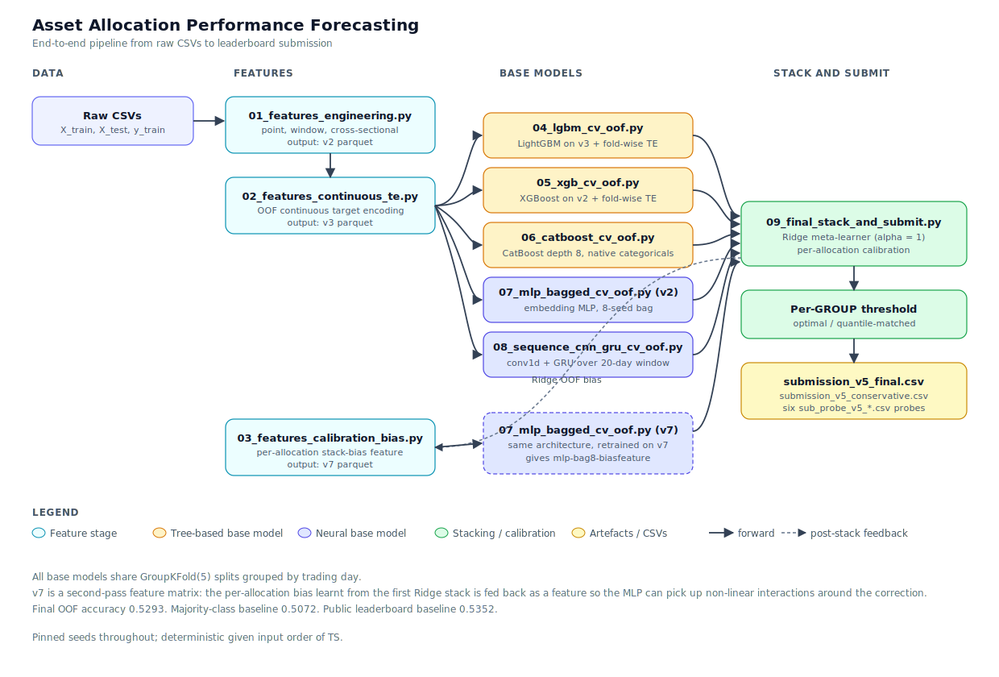

# Asset Allocation Performance Forecasting

QRT / ENS Data Challenge 167. The task is to predict the sign of the
next trading day's return for a universe of 278 asset allocations, given
a rolling 20 day window of past returns and signed volumes plus a small
set of static features.

Training data spans 2522 anonymised trading days and roughly 527k
(allocation, day) rows. The test set covers the next 120 days and
contains 31870 rows. Labels are binary and near balanced at 50.7 percent
positive. The signal to noise ratio is low, so the work here is a
deliberate exercise in model diversity, honest cross validation and
post hoc calibration rather than chasing a single large model.


## Results

| Stage                                 | 5 fold OOF accuracy |
|---------------------------------------|:-------------------:|
| Best single base model (bagged MLP)   | 0.5288              |
| Ridge stack of six base models        | 0.5286              |
| Stack with per allocation calibration | 0.5288              |
| Final, per GROUP optimal threshold    | **0.5293**          |


## Pipeline



Data flows left to right through four stages: feature engineering, six
base models trained under a shared `GroupKFold(5)` split, a Ridge stack
with per allocation calibration, and finally a per `GROUP` threshold
that writes the CSV submissions. The dashed arrow is the one feedback
loop in the pipeline: the honest out of fold bias of the first Ridge
stack is fed back as a feature into a second pass of the MLP.


## Modelling choices

**Validation.** Every cross validation split uses `GroupKFold(5)` with
the trading day as the group. This keeps all rows from a given day on
one side of the split, which is the single most important guard against
leakage in this dataset because cross sectional ranks and per day
aggregates would otherwise trivially leak the target.

**Features.** The feature pipeline is organised as a chain where each
revision extends the previous one. A feature matrix is persisted to
parquet after each stage so downstream models can be trained without
recomputing upstream features.

* `v2` contains point features of `RET_1` through `RET_20`, expanding
  window statistics, volatility ratios, skew and kurtosis, sign flips,
  drawdown and OLS slope on the 20 day window, plus signed volume
  aggregates, per allocation long run statistics from concatenated train
  and test rows, and cross sectional rank / median deviation / z score
  within each trading day and each `(TS, GROUP)` cell.
* `v3` adds three out of fold continuous target encodings on
  `ALLOC_ID` and `AG_ID` using empirical Bayes shrinkage toward the
  fold's global mean. These are strictly safer than the more common sign
  based encodings because the continuous target carries more information.
* `v7` adds a single per allocation calibration bias feature derived
  from the Ridge stack OOF. It is used only by the final MLP.

**Base models.** Six models with deliberately different inductive biases:

1. LightGBM with fold wise target encoding on `ALLOC_ID`, `AG_ID` and
   `GROUP`, trained on `v3` features.
2. XGBoost with the same fold wise encoding, trained on `v2`.
3. CatBoost depth 8 with native categorical handling, trained on `v2`.
4. Bagged embedding MLP, eight independent seeds averaged per fold,
   trained on `v2`.
5. Small 1D CNN followed by a GRU reading the raw 20 day return and
   signed volume window, trained on raw arrays.
6. The same bagged MLP architecture retrained on `v7`, which means it
   sees the per allocation calibration bias signal as an input.

All six share the same `GroupKFold(5)` schedule and are combined as a
stack rather than averaged. Diversity comes from the different input
representations and losses, not from hyper parameter variation.

**Meta learner.** A plain `Ridge(alpha=1)` fitted on the six OOF vectors.
Logistic regression, Ridge and a shallow XGBoost meta learner were
compared under the same cross validation schedule; Ridge wins on both
OOF accuracy and the meta fold standard deviation. Ridge coefficients
are easy to inspect and make the meta layer reproducible.

**Calibration.** After stacking, residual per allocation bias remains:
mean predicted probability for an allocation does not always equal its
empirical win rate on the OOF fold. A per allocation additive shift is
learnt from OOF and applied to both train and test. This is strictly
post hoc and uses only the OOF predictions, never the test side.

**Thresholding.** The decision threshold is chosen per `GROUP` on the
calibrated OOF probabilities. A drift robust variant that pins the
predicted positive fraction inside each `GROUP` to the in sample
positive rate is also saved, on the reasoning that the test window is
strictly later in time and the true positive rate may have drifted.


## Repository layout

```
Challenge data.pdf                     official competition brief
X_train_9xQjqvZ.csv                    raw training features
X_test_1zTtEnD.csv                     raw test features
y_train_Ppwhaz8.csv                    training labels
sample_submission_SpGVFuH.csv          ID layout required by the platform
benchmark_submission.ipynb             organiser provided benchmark

src/config.py                          project paths and shared constants
src/01_features_engineering.py         v2 feature matrix
src/02_features_continuous_te.py       v3 feature matrix
src/03_features_calibration_bias.py    v7 feature matrix
src/04_lgbm_cv_oof.py                  LightGBM base model
src/05_xgb_cv_oof.py                   XGBoost base model
src/06_catboost_cv_oof.py              CatBoost base model
src/07_mlp_bagged_cv_oof.py            bagged embedding MLP
src/08_sequence_cnn_gru_cv_oof.py      CNN + GRU on the 20 day window
src/09_final_stack_and_submit.py       Ridge stack, calibration, submissions

run_pipeline.sh                        orchestrates all nine stages
requirements.txt                       pinned dependencies
```

Intermediate artefacts (feature parquets, OOF arrays, meta scores) land
under `work/`. This directory is recreated on every run and is ignored
by git.


## Running the pipeline

Any POSIX system with Python 3.10 or newer is sufficient. No cloud or
GPU is required; the pipeline completes in roughly twenty minutes on a
MacBook using Apple MPS, or about an hour on a modern CPU only laptop.

```bash
# optional: pin a specific Python interpreter
export PYTHON=python3.10

# install dependencies
pip install -r requirements.txt

# run the full pipeline
bash run_pipeline.sh
```

The two final submissions are written at project root:

| File                              | Threshold strategy                                  | Recommended use               |
|-----------------------------------|-----------------------------------------------------|-------------------------------|
| `submission_v5_final.csv`         | per GROUP optimal on calibrated OOF                 | best cross validation         |
| `submission_v5_conservative.csv`  | per GROUP quantile matched to training positive rate| drift robust default          |

Six probe submissions `sub_probe_v5_*.csv` force the predicted positive
fraction to a specific value (0.48, 0.50, 0.507, 0.53, 0.55, 0.58) and
are used to localise the true test positive rate from public leaderboard
feedback.


## Reproducibility

Every random seed is pinned at `42` via `config.RANDOM_SEED`. The
`GroupKFold(5)` split is deterministic given the input order of `TS`.
Neural networks additionally seed `torch` and `numpy` per bag seed. All
model hyper parameters are defined inline at the top of each script and
are the values used for the final submission.


## Acknowledgements

This is a solution to the [QRT Asset Allocation Performance Forecasting
challenge](https://challengedata.ens.fr/participants/challenges/167/)
hosted by ENS. Raw data is provided by Qube Research & Technologies
under the competition terms and is included only for reproducibility.
